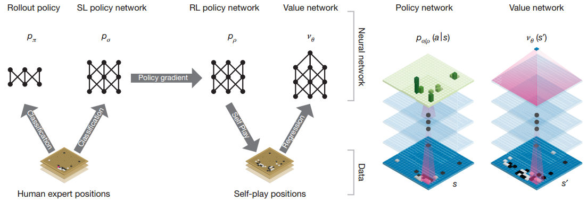
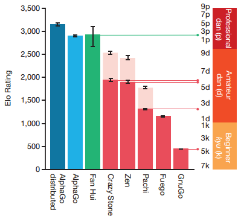

# Research Review
## Mastering the game of Go with deep neural networks and tree search
February 19, 2017  
Terence So

 

**AlphaGo** is the first computer program to play Go at a professional level, a feat previously thought of to be at least a decade away. Developed by the Google Deepmind team, AlphaGo was able to defeat European champion Fan Hui, a professional 2-dan player 5-0.

### The Game of Go

The **Game of Go** is played on a 19x19 board where two players alternately place stones until a player runs out of moves or resigns. Like chess, Go is defined as an alternating Markov game. These games are traditionally solved by finding the optimal move using search trees that represent of moves and board states. A search tree contains approximately bd possible sequences of moves, where b is the game’s breadth (number of legal moves per position) and d is its depth (game length). For Chess, the size of the tree is about 3580 or 3 x 10123.  In contrast, Go has about 250150 or 5 x 10359 nodes in its search tree, many magnitudes greater in terms of complexity.

### Monte Carlo Tree Search

The size of the search trees quickly render brute force approaches intractable. Modern techniques that circumvent this problem include **Monte Carlo Tree Search** (MCTS). Monte Carlo simulations (or 'rollouts') search to maximum depth by sampling long sequences of actions for both players from a specified policy. Averaging end state rewards over such rollouts can provide a fuzzy but effective evaluation of board position without resorting to exhaustive branching.

### Neural Networks

Recent advances in deep **Convolutional Neural Networks** (CNNs) have achieved unprecedented
performance in visual domains: for example, image classification, facial recognition, and playing Atari games. AlphaGo applies CNNs to Go by treating board as a 19x19 input image. There are two types of CNNs used: a *value network* for evaluating a board position, and a *policy network* that suggests high value moves. These neural nets also dramatically reduce the search by narrowing the number of branches to explore in the search tree.  AlphaGo combines both types of networks with MCTS to provide unprecedented performance in computer Go.

### AlphaGo Training and Architecture

AlphaGo's neural networks go through 2 stages of training. The first stage trains 2 policy networks using **Supervised Learning**: a 13-layer **(SL) policy network**, and a simpler fast rollout **(FR) policy network** to be used in MCTS rollouts. Given a board state, the output of these networks is a probability distribution of board positions used in the selection of next possible moves. Both networks were trained to predict human expert moves on 30 million positions from the KGS Go Server.

The second stage uses **Reinforcement Learning** on an **RL policy network** with the same architecture and initialized to the SL network from the first stage. The RL network is then pitted against previous iterations of itself in multiple games of Go and updated based on the outcome using Stochastic Gradient Ascent.

Finally, the RL network was used to generate a self-play dataset consisting of 30 million distinct positions, each sampled from a separate game. Each game was played between the RL policy network and itself until the game terminated. This dataset is then used to train a **Value network** on predicting game outcomes. This network will later be used to evaluate the value of board states in MCTS.

### Neural Networks with Monte Carlo

While waiting for its turn, AlphaGo's spends its time thinking many moves ahead, forecasting its opponent's as well as determining its own moves to reach the best possible outcome (a win). To do this AlphaGo combines the FR policy, SL policy, and Value network with an MCTS algorithm. When idle, AlphaGo expands and refines its search tree by means of simulation. The best move is chosen at the end of the simulations. Starting from the root state (current state of the board) it traverses its search tree by selecting actions that maximize action value (more likely to win). When the traversal reaches a leaf node, the leaf node may be expanded and this when the neural networks come into play.

First, the leaf node is processed by the SL policy to produce actions and their corresponding probabilities. These probabilities are used to guide the search between exploration and exploitation to prevent the tree from expanding too much or too little. Second, the leaf node is evaluated using the value network. Third, moves are generated by the FR policy network to play out the node till the end (a rollout). The outcome of the rollout and the result of the value network is combined into a weighted average as the valuation of new node. The simulation then continues from the new node by selecting the next best action. At the end of simulation, the action values and visit counts of all traversed edges are updated and another simulation begins anew.

Once the search is complete (time runs out and AlphaGo must make a move), the algorithm chooses the most visited move from the root position. A new root node is chosen based on the action and irrelevant nodes are pruned from the tree and another simulation process begins.

### Results

AlphaGo was evaluated by running an internal tournament among variants of AlphaGo and several other Go programs, including the strongest commercial programs Crazy Stone13 and Zen, and the strongest open source programs Pachi14 and Fuego15. All of these programs are based on high-performance MCTS algorithms. All programs were allowed 5 s of computation time per move. The results of the tournament (see Fig. 4a) suggest that singlemachine AlphaGo is many dan ranks stronger than any previous Go program, winning 494 out of 495 games (99.8%) against other Go programs.

The distributed version of AlphaGo was also evaluated against Fan Hui, a professional 2 dan, and the winner of the 2013, 2014 and 2015 European Go championships. AlphaGo won the match 5 games to 0. This is the first time that a computer Go program has defeated a human professional player, without handicap, in the full game of Go.
